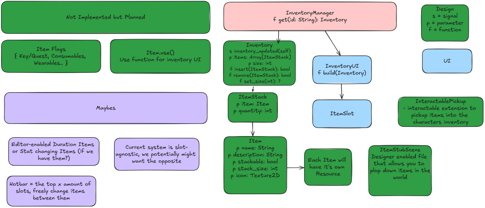

# TGO Design Process

- [TGO Design Process](#tgo-design-process)
  - [Purpose](#purpose)
  - [Suggested workflow](#suggested-workflow)
  - [Example](#example)
  - [Addendum: What is a "Box and Arrows" diagram?](#addendum-what-is-a-box-and-arrows-diagram)

## Purpose

The point of our design process is to have a repeatable way to start with a
problem and turn it into a solution that...
- works well with existing systems:
  - the ones you understand, and
  - and the ones you don't;
- has buy-in from the rest of the team;
- course-corrects early for design decisions that could be problematic;
- benefits from the intuition of the whole team without requiring deep
  involvement in the development cycle.

And, hopefully, one final benefit is that having a structured design process is
that when you take on a task that is kind of stretchy -- something you want
to do but don't know how -- there is a path already laid out on how to get to
an answer. The goal of SLS/TGO is to produce a game but it's also to give us
all opportunities to level up our disciplines and that mean we shouldn't have
to be afraid of not having the answer for how to tackle our next task.

## Suggested workflow

> The following is a highly granular breakdown for clarity but in practice
> you'll likely combine steps 1-3 so the process is, at its core, research
> -> work -> feedback -> build.

So you've got some job to do and you're not sure what the right way to do it is!
That's cool, let's get it sorted out:

1. **Understand the problem.**  
   Make sure you have a good grasp on the thing you even need to do! It's
   nearly impossible to solve a problem if you're building something with the
   wrong goal in mind. Examine the systems you are likely to interact with
   and the ones that you depend on. This will mostly take place in your head,
   by reading code / docs, and asking questions.
2. **Write down the goal, and the problems.**  
   Now that you know _what_ you're solving write it down. Write down the tricky
   parts and what you're unsure of. This may never get seen by anybody else but
   it will help you keep in your mind the things that feel important when doing
   your initial design.
3. **Research existing solutions.**  
   If relevant check for guides, tutorials, conference talks, add-ons, etc.
   Don't try to invent everything from scratch if you don't have to. Add these
   to your running write-up as references.
4. **Solve the problem!**  
   I know it's kind of a [now draw the owl](https://knowyourmeme.com/memes/how-to-draw-an-owl)
   statement but you've gotten all the information you need to make a good
   design and the next step really is to do it. Note that this _does not_ mean
   building the solution. Solving the problem is about taking your research and
   original thoughts and putting together a plan specific to your problem.  
   For the purposes of this workflow the default artifact here will be a "box
   and arrows" diagram (see the example below) and a writeup as necessary.
5. **Present your ideas / Gather feedback**  
   A good design process results in an end product that benefits from the
   collective cleverness of the whole team. We're going to facilitate that by
   taking your documentation from 4 and discussing it as a group. That meeting
   is _ideally_ over voice chat but can be asynchronous if scheduling is overly
   complicated. The meeting structure should roughly be:
      - Send out your docs from 4 (the write up & related diagrams) so people
        can do a pre-read and come ready to talk about your ideas
      - Schedule a meeting and get feedback
6. **Incorporate feedback and build it.**  
   You got some feedback and maybe you need to make changes. If they're large
   enough to follow up afterward then you can probably get away with 1:1 meetings.
   If you end up making substantial changes it may merit a repeat of step 5.
   As a bonus because you have a good bit of documentation written about how
   this system works you're in a good position to leave new material in
   [the docs folder](./) so that when one of us forgets how everything fits
   together we can dip in there to find out.

## Example

When Blob was building inventory we actually went through this process so let's
take a look at how can work in a real situation.

- **Step 1, 2, 3**: Blob picked up the Inventory+Items task and the first thing
  they did was ask questions to explore the game's requirements. As part of
  this process they ended up with a set of notes outlining what needed to be built.
  Naturally during conversation we also discussed some good reference material
  & YouTube discussions on existing designs that might be useful.
- **Step 4**: A significant amount of code was actually written during this
  phase in the process of fully baking ideas. In addition heading into the
  feedback session there was a [design doc](https://github.com/Small-Loan-Studio/TGO/blob/fc0956cc47ddcd0acedc3d859195f3584db0678f/docs/tgo-inventory.md)
  produced and a diagram:
  
- **Step 5**: After getting access to the write-up and the design diagram we took
  a few days to do a read of it + think about how it interacted with other systems
  that Blob maybe didn't have a ton of knowledge about the working of. Then there
  was a chat that lasted ~30 minutes -- we discussed some of the behavior, the API,
  and some of the design decision resulting in a couple of changes / simplifications.
- **Step 6**: Blob got feedback and made necessary changes then put up [a PR](https://github.com/Small-Loan-Studio/TGO/pull/23).

## Addendum: What is a "Box and Arrows" diagram?

We've mentioned a "box and arrows" diagram a couple of times here and even given
and example. But what is it really?

Well, there's no formal definition that I know of but I use it to describe a
low-overhead design document that helps you/your readers understand the major
components of a system and how they work together / integrate with other aspects
of the game. Roughly:
- each major component of your design gets a "box"
- interactions between components get an "arrow" indicating how they connect

The Inventory example above is one form that's focused on a single system but
it's not canonical in any way. You don't need APIs or attributes listed, often
you'll include systems that you aren't directly modifying, etc. Even something
as simple as the Scene tree breakdown we have in [tgo-arch.md](./tgo-arch.md#prospective-scene-tree)
could be considered one.

Some tools I find useful when building these are:
- https://tree.nathanfriend.io/ &mdash; for the ASCII trees
- [excalidraw](https://excalidraw.com/) or [draw.io](https://app.diagrams.net/) &mdash; for more complicated diagrams like the Inventory example