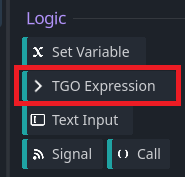
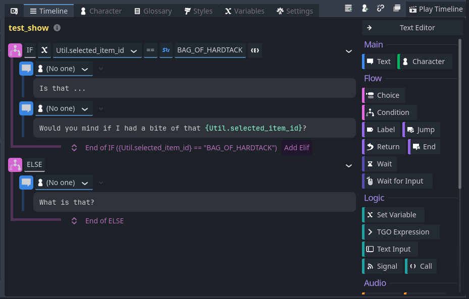

# TGO & Dialogic

- [TGO \& Dialogic](#tgo--dialogic)
  - [Introduction](#introduction)
  - [Survey Video](#survey-video)
  - [Using Supported Expressions](#using-supported-expressions)
    - [In conditionals](#in-conditionals)
    - [Outside conditionals](#outside-conditionals)
  - [Dealing with Items](#dealing-with-items)
  - [Available Logic](#available-logic)
    - [Inventory state](#inventory-state)
      - [Getting a specific inventory](#getting-a-specific-inventory)
      - [Getting Devin's inventory](#getting-devins-inventory)
      - [Has Exactly N items](#has-exactly-n-items)
      - [Has At Least N items](#has-at-least-n-items)
      - [Add an item to an inventory](#add-an-item-to-an-inventory)
      - [Remove an item from an inventory](#remove-an-item-from-an-inventory)
      - [Check if an inventory has room for an item](#check-if-an-inventory-has-room-for-an-item)
    - [Quests](#quests)
      - [Accessing a specific quest](#accessing-a-specific-quest)
      - [Check if a quest is finished](#check-if-a-quest-is-finished)
      - [Check if a quest is completed](#check-if-a-quest-is-completed)
      - [Check if a quest is failed](#check-if-a-quest-is-failed)
      - [Start a quest](#start-a-quest)
      - [Complete a quest](#complete-a-quest)
      - [Fail a quest](#fail-a-quest)
    - [Time of Day](#time-of-day)
      - [Is it a specific segment of the day?](#is-it-a-specific-segment-of-the-day)
      - [Is the current time before HH:MM](#is-the-current-time-before-hhmm)
      - [Is the current time after HH:MM](#is-the-current-time-after-hhmm)
      - [Is the current time between HH:MM and HH:MM](#is-the-current-time-between-hhmm-and-hhmm)
      - [Set the time](#set-the-time)
  - [Audio Integration](#audio-integration)
    - [Send RTPC value](#send-rtpc-value)
    - [Check RTPC value](#check-rtpc-value)
    - [Fire an event](#fire-an-event)

## Introduction

We use Dialogic 2 to support our in-game dialog and to store game state. It's
a widely adopted system within the Godot-community which is good! There are a
lot of community provided tutorials on how to use it, e.g., [Learn Dialogic Fast!][ldf]
and [How to use Dialogic 2][htdl2].

For general introductory material we'll rely on those tutorials. However there are
several custom integrations that we will use to allow the TGO Narrative team to
interact with the state of the game world.

## Survey Video

To start let's review the [TGO Dialogic video][tdlv] where we start to expolre using
TGO specific additions. In the segment I've linked to you can see that we are using a
custom expression to check inventory state.

## Using Supported Expressions

### In conditionals
In the video I show the basic expression structure:
1. Surround by braces `{` & `}`
2. Use `TGO` to indicate you're using our custom logic
3. Use `.` to indicate you're moving on to the next part of your request, e.g., `TGO.player_inventory.has` can be read as:
    - I want to use `TGO` specific logic, and then
    - I want to interact with the `player_inventory`, and then
    - I want to check if it `has` some item
4. Use `(` `)` to indicate the specifics of our request, e.g., from our video example `TGO.player_inventory.has("ALTAR_POTION")` is checking if `"ALTAR_POTION"` is in our inventory.
    - If you have multiple things you need to specify break them up with `,`: `TGO.player_inventory.has("ALTAR_POTION", 3)` will check if the player is carrying at least 3 ALTAR_POTIONS
5. Each of these questions may return some answer. That answer depends on the question being asked and is documented below.

### Outside conditionals
Conditionals are fine for checking the state of the world but if you just want
to take some action--having an NPC given Devin a potion for instance--then you
can do that directly using the `Logic / TGO Expression` block:

This provides a field where, for now, you can use the same structure as above to
use specific TGO logic. To have somebody give Devin two potions the expression
would be: `TGO.player_inventory.add_item("HEALTH_POTION", 2)`.

## Dealing with Items
When writing dialogue that handles "Show" and "Give" the dialogue will be
called with a variable set containing the ID of the item being shown or
offered. That variable is `Util.selected_item_id`. You can use it in a
dialogue line as `{Util.selected_item_id}

This means you can use conditions to construct the response; something like

    if {Util.selected_item_id} == "BAG_OF_HARDTACK":
      Is that ...
      Would you mind if I had a bite of that {Util.selected_item_id}?
    else:
      What is that?

Or from the Visual Editor:

## Available Logic

### Inventory state

Inventory in TGO is associated with an ID so in order to check contents or add
and remove items you have to provide an id first:

#### Getting a specific inventory
`{TGO.use_inventory("<inventory_id>").<action>}` to access the inventory called
`<inventory_id>` and take `<action>`

**Examples:**
- `{TGO.use_inventory("Devin").<action>}` -> perform some action on the player's inventory
- `{TGO.use_inventory("Buckley").<action>}` -> perform some action on the Mayor Buckley's inventory
---

#### Getting Devin's inventory
Because it's likely that we'll access Devin's inventory more than any others we
have a special way to access that: `{TGO.player_inventory.<action>}`.

This is functionally the same thing as `{TGO.use_inventory("Devin").<action>}`

Once you have an inventory these are the things you can do:

#### Has Exactly N items
> returns: bool (true/false)
- `.has(<item_id>)` -- returns true if the inventory has exactly 1 `<item_id>`
- `.has(<item_id>, <count>)` -- returns true if the inventory has exactly `<count>` `<item_id>`

**Examples**
- `{TGO.player_inventory.has("HEALTH_POTION")}` -> does the player have one health potion
- `{TGO.use_inventory("mayor_chest").has("SECRET_AMULET", 2)}` -> does the `mayor_chest` inventory have two secret amulets
---

#### Has At Least N items
> returns: bool (true/false)
- `.at_least(<item_id>)` -- returns true if the inventory has at least 1 `<item_id>`
- `.at_least(<item_id>, <count>)` -- returns true if the inventory has at least `<count>` `<item_id>`

**Examples**
- `{TGO.player_inventory.at_least("HEALTH_POTION", 3)}` -> does the player have 3 or more health potions
- `{TGO.use_inventory("mayor_chest").at_least("SECRET_AMULET", 2)}` -> does the `mayor_chest` inventory have two or more secret amulets
---

#### Add an item to an inventory
> returns: bool (true/false) - indicates if the item was successfully added. An
> add may fail if the inventory would be too full if we added the item in question.
> Will also return false if we are adding more items than that item's stack size.
- `.add_item(<item_id>)` -- adds one `<item_id>` to the inventory
- `.add_item(<item_id>, <count>)` -- adds `<count>` `<item_id>` to the inventory

**Examples:**
- `{TGO.use_inventory("innkeep").add_item("BIG_MUG")}` -> Adds a single big mug to the innkeep's inventory
- `{TGO.player_inventory.add_item("MAGIC_STICK", 2)}` -> adds two magic sticks to Devin's inventory
---

#### Remove an item from an inventory
> returns: bool (true/false) - indicates if we were able to successfully remove an item
> from an inventory. Failure to remove will happen if there are not enough items inside
> to remove. In that case no items will be removed.
- `.remove_item(<item_id>)` -> remove one `<item_id>` from the inventory
- `.remove_item(<item_id>, <count>)` -> remove `<count>` `<item_id>` from the inventory

**Examples:**
- `{TGO.use_inventory("tree_stump").remove_item("WEIRD_FUNGI")}` -> Take one weird fungi from the tree stump
- `{TGO.player_inventory.remove_item("MAGIC_BEAN", 3)}` -> Devin has 3 magic beans removed from his inventory
---

#### Check if an inventory has room for an item
> return: bool (true/false) - indicates if the item can fit. Will also fail if checking if
> it's possible to add more than the quantity of a single item's stack size.

- `.has_room(<item_id>, <count>)` -> check if the inventory can hold an additional `<count>` of `<item_id>`

**Examples:**
- `{TGO.player_inventory.has_room("TOWEL", 1)}` -> can devin hold one more towel?
---

### Quests
Similar to inventories each quest has an ID that's used to interact with it:

#### Accessing a specific quest
`{TGO.quest(<quest_id>).<action>}` is how we interrogate quests in dialogic.

**Examples:**
- `{TGO.quest("FIND_PUCA_HINTS").<action>}` -> interact with the quest called FIND_PUCA_HINTS
- `{TGO.quest("GET_INN_ROOM").<action>}` -> interact with a quest about geting a room at the inn
---

#### Check if a quest is finished
> returns: bool (true/false) - indicates if a quest is **either** completed **or** failed
- `.is_finished()`

**Examples:**:
- `{TGO.quest("TRACK_GHOSTS").is_finished()}` -> has Devin failed or completed the quest about tracking ghosts?
---

#### Check if a quest is completed
> returns: bool (true/false) - indicates if a quest is completed -- this is the quest success state
- `.is_completed()`

**Examples:**
- `{TGO.quest("DRINK_WITH_PATRONS").is_completed()}` -> did Devin successfully drink with the tavern patrons?
---

#### Check if a quest is failed
> returns: bool (true/false) - indicates if a quest is failed -- this is the quset failure state
- `.is_failed()`

**Examples:**
- `{TGO.quest("BE_COOL_BRO").is_failed()}` -> did Devin successfully maintain his composure
---

#### Start a quest
> returns: bool (true/false) - start a quest, may return false (mostly) if the quest is already finished or in progress
- `.start()`

**Examples:**
- `{TGO.quest("GO_ADVENTURE").start()}` -> this will start the quest about adventuring
---

#### Complete a quest
> returns: bool (true/false) - mark a quset successfully completed, may return false (mostly) if the quest is not in progress or already finished
- `.complete()`

**Examples:**
- `{TGO.quest("FIND_OAKSHAW").complete()}` -> Mark that Devin has successfully found the town of Oakshaw
---

#### Fail a quest
> returns: bool (true/false) - mark a quset as failed, may return false (mostly) if the quest is not in progress or already finished
- `fail()`

**Examples:**
- `{TGO.quest("PET_THE_DOG").fail()}` -> Devin did not pet the dog. I don't know why. Nobody knows why. I have questions about Devin as a person.
---

### Time of Day

In addition to quests and inventory management we can query and change the
Time in Oakshaw using `{TGO.time_of_day.<action>}`

#### Is it a specific segment of the day?
> returns bool (true/false) - true when the current time is in the segment requested
- `.is_time_of_day(<time_of_day>)`

The valid options for the time of day are:
- `dawn`
- `day`
- `dusk`
- `night`

**Examples:**
- `{TGO.time_of_day.is_time_of_day("dusk")}` -> checks if it is dusk
- `{TGO.time_of_day.is_time_of_day("dawn")}` -> checks if it is dawn

---

#### Is the current time before HH:MM
> returns : bool (true/false) - returns true if the current time is before the provided time
- `.is_before(<HH:MM>)`

**Examples:**

- `{TGO.time_of_day.is_before("9:30")}` -> checks if the current time is before 9:30 am
- `{TGO.time_of_day.is_before("14:00")}` -> checks if the current time is before 2pm. Note
  
> Note that time is specified in 24h format and the only valid values are `00:00` to `23:59`
---

#### Is the current time after HH:MM
> returns: bool (true/false) - returns true if the current time is after the provided time
- `.is_after(<HH:MM>>)`

**Examples:**

- `{TGO.time_of_day.is_after("12:00")}` -> returns true if the current time is after 12 noon
- `{TGO.time_of_day.is_after("22:00")}` -> returns true if the current time is after 10pm

> Note that time is specified in 24h format and the only valid values are `00:00` to `23:59`
---

#### Is the current time between HH:MM and HH:MM
> returns: bool (true/false) - returns true if the current time is between two specified times
- `.is_between(<start_time_HH:MM>, <stop_time_HH:MM>)`

**Examples:**

- `{TGO.time_of_day.is_between("00:00", "06:30")}` -> returns true if the current time is between midnight and 6:30am
- `{TGO.time_of_day.is_between("18:00", "23:59")}` -> returns true if the current time is 6pm and (almost) midnight

> Notes:
> 1. time is specified in 24h format  
> 2. the earlier time is assumed to be provided first
> 3. this does not handle time "wrapping around" into a new day, in other words `is_between("19:00", "06:00")` does **not** mean between 7pm and 6am. Rather it has no meaning
---

#### Set the time
> returns: nothing
- `.set_time(<HH:MM>)`

**Examples:**

- `{TGO.time_of_day.set_time("06:00")}` -> set the time to 6am
- `{TGO.time_of_day.set_time("19:00")}` -> set the time to 7pm

[ldf]: https://www.youtube.com/watch?v=7PuPU0Mrl_g
[htdl2]: https://www.youtube.com/watch?v=0JPNmQ27uwA&list=PLPwlXx18zF7EKPb4sVu4gZ9S7XS0-ad_a
[tdlv]: https://youtu.be/uX23Jbmh7WU?t=722

## Audio Integration

Integration with Wwise is possible from within Dialogic as well. At the moment
we have only RTPC and events wired up but more can be done as needed. The current
method to access audio operations is: `{TGO.audio("<character_id>").<action>(<parameters>)}`.

At the moment _only_ characters can be used as a host for events or RTPC emissions.
This means hanging things off 'AudioManager' doesn't work from within the context
of a Dialogue. This isn't set in stone and plumbing the AudioManager here is easy
but a bit of overhead I wasn't initially sure was necessary... so it got skipped
for v0.

### Send RTPC value
> returns: boolean -- true or false if the RTPC was successfully sent. Generally you can ignore this as.
- `rtpc('<parameter name>', <parameter_value>)`

**Examples:**  
- `{TGO.audio("Devin").rtpc("PlayerHealth_RTPC", 30)}` -> tell the audio system that Devin is at 30 health. Note that this _only_ informs the audio subsystem about the change, it doesn't actually impact any other systems or actually change Devin's health.

### Check RTPC value
> returns: float -- the value of a specific RTPC

**Examples:**  
- `{TGO.audio("Devin").get_rtpc("PlayerHealth_RTPC")}` -> get the player health as reported to Wwise. Note that this may differ from the in-engine values. Probably most frequently used as debugging.

### Fire an event
> returns: int - the event id that can be passed into stop
> 
> note that I don't know a good way to capture the return value at the moment,
> if it becomes essential to sort out we can; there may also be something in
> dialogic itself that would let you do it (maybe placing the fire call as the
> contents of a Set variable call)

**Examples:**  
- `{TGO.audio("Devin").fire("LevelStart")}` -> fires the level start event from Devin