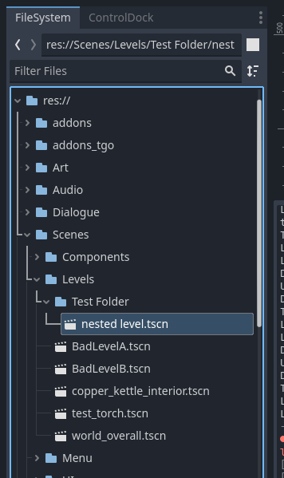

# Video Guide Errata

- [Video Guide Errata](#video-guide-errata)
	- [Source Material](#source-material)
	- [Tilemap Changes](#tilemap-changes)
		- [Canopy](#canopy)
	- [Level Changes](#level-changes)
		- [Setting Driver Autoload Level](#setting-driver-autoload-level)
		- [Referencing Level](#referencing-level)

This is intended as a companion document to the Design Toolkit guide
and any other video tutorials that are hard to change after the fact.

## Source Material
The list of videos that will be referenced here

- [TGO Design Toolkit Playlist][toolset-playlist]
- [TGO Architecture Intro][tgo-arch]

## Tilemap Changes
### Canopy

> [video ref](https://youtu.be/6NawSaaFHdg?t=1566)

Previously the "canopy" layer was the top layer that we intended to always be
draw on top of the player and be unlit. This doesn't actually work out for a
layer within a tilemap so I had to break that single layer into its own tilemap.

Now we have `TileMap` which contains the lit layers (L0->L3) and a `CanopyMap`
which contains a tilemap that is unlit.

## Level Changes
### Setting Driver Autoload Level
> see [Referencing Level](#referencing-level)

### Referencing Level

> [video ref](https://youtu.be/aO6npl7AIT8?list=PL-u-qjmzyjPWRhyIqXs4uOrQIxwAf-BVj&t=237)

Basically the way we reference a level in the editor have changed. We no longer need to
pick the tscn file or provide a full filepath. Instead each level is implicitly named based
on it's path relative to `Scenes/Level`. In other words if the file tree looks like this:

And we wanted to reference `nested level.tscn` we would specify it as: `Test Folder/nested level`.
Note that we exclude the `.tscn` extension as well as the original folder path.

For non-nested levels, e.g. `BadLevelA.tscn` it would be simple `BadLevelA`.

[toolset-playlist]: https://www.youtube.com/watch?v=sdmigctjJE4&list=PL-u-qjmzyjPWRhyIqXs4uOrQIxwAf-BVj
[tgo-arch]: https://www.youtube.com/watch?v=6NawSaaFHdg
