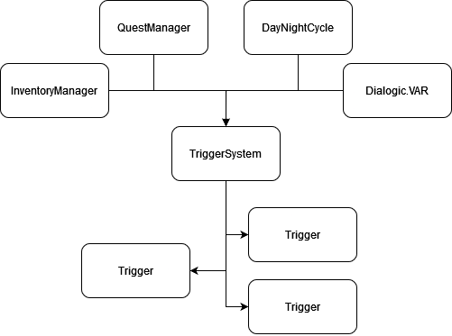
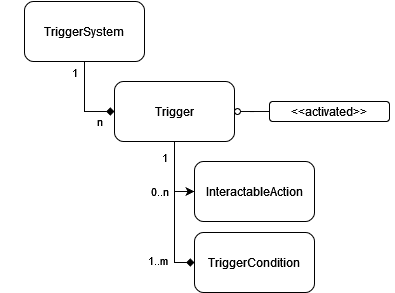

# Building Interactive Systems

> **Goal:** Explore how we enable level designers to build a world that reacts
> to itself and to player action.

- [Building Interactive Systems](#building-interactive-systems)
  - [Reactive Systems](#reactive-systems)
    - [A New LevelBase Section:](#a-new-levelbase-section)
    - [Philosophy](#philosophy)
    - [Setup](#setup)
    - [Addendum: Level-spanning Triggers](#addendum-level-spanning-triggers)
      - [Old Code Sketch](#old-code-sketch)
    - [Trigger Structure:](#trigger-structure)
  - [Position-dependent behaviors](#position-dependent-behaviors)
    - [Switch](#switch)
    - [Configurable Properties](#configurable-properties)
    - [Methods](#methods)
  - [Notes:](#notes)
    - [PR Ordering](#pr-ordering)

## Reactive Systems
> "When we reach state X do thing Y."

- Use Dialogic's `VAR.set_variable` / `subsystem_variable.gd` to store game state
- Track changes via `VAR.variable_changed`
  - `VAR.variable_set_state` doesn't quite work because that only gets emitted
    via an `_execute` of a `set` expression from a timeline
  - `VAR.reset` by default doesn't trigger variable_changed but it's a pretty
    minor diff to get that in place if necessary (for specific variable resets;
    a full reset is harder).

### A New LevelBase Section:
In order to organize the level we'll introduce a new top-level item:

```
Level
├── TileMap
├── Objects
│   └── Characters
├── Markers
└── TriggerSystem
```

In lieu of a custom UI to help manage triggers in a scene we'll build `Trigger`
as a `Node` subclass and each new trigger will be added as a child of the new
`TriggerSystem` group, e.g.,:

```
Level
...
└── TriggerSystem
    ├── Trigger1
    ├── Trigger2
    ├── Trigger3
    └── Trigger4
```

### Philosophy

A `Trigger` is intended to be a _reactive_ component. We shouldn't have to
evaluate the conditions on every game loop. Rather we do it:

1. once when the scene containing the trigger is loaded in, and
2. when any of the relevant conditions change state

In order to facilitate 2 each Trigger registers itself for notifications of
changes. Instead of having each trigger hook to every possible source we'll
use the `TriggerSystem` parent node as a hub that connects to all sources and
takes registrations of interest from each child trigger so that it knows
how to process & delegate incoming events. In theory this is not materially
different than having it baked into a `Trigger` parent/utility class but
I think in practice a single central dispatch will be more approachable.

### Setup
**TriggerSystem:**  
- Handles registering & deregistering to the data sources when a level is
  loading & unloading;
- When `_ready` is called it walks its children and gets the list of
  conditions and sets up links in some internal data structure so that
  it knows where to forward updates;
- When a handler is called it checks the structure and calls `evaluate()`
  or a similar function on the relevant trigger.

**Trigger:**  
- contains a list of conditions that should be met;
- Is a parent class, allows for custom evaluators (assuming gdscript works
  rationally for Resource inheritance);
- Without a custom evaluator the default behavior will be ANDing conditions;
- When the evaluator returns true a sequence of `InteractableAction`s are
  triggered, if set, and a signal is emitted if more bespoke logic is needed;
- Once fired a Trigger is considered "spent" unless it is explicitly reset.
  - If we need multiply firing triggers for now we should err on the side of
    using Dialogic.VAR to track previous executions and include that in a
    second distinct trigger as a condition that must be met.

**TriggerCondition:**  
Simple container that specifies: data source, data key / identifier, check
operator, and some desired value.

Can provide multiple partially-applied conditions for common checks, e.g.:
- Dialogic.VAR {equals, at least}
- Inventory {id} contains {item}
- Time of day is (not?) {day, dusk, night, dawn}
- Quest {id} state is {started, finished}

**Diagrams!**  

How data flows from a source into the individual triggers that handle evaluation.



The relationship between various trigger system components; 



### Addendum: Level-spanning Triggers
Because triggers are bound to a level and get loaded/unloaded with it there
is a gap is how to handle things that should be reactive regardless of the
level the player is exploring.

My current feeling is that many of these are likely solved by a reactive
Quest system. For those that aren't I don't have a good solution in place.
One possible path we'll likely start down if the need arises will be to
create a TriggerSystem that lives at the global scope and include an API
for `add_trigger(id: String, definition: Trigger, callback_fn: Callable)`
or similar.

#### Old Code Sketch
<details>

### Trigger Structure:

This could be as simple or as complicated as we want. From the simple:

```
class_name Trigger extends Resource
var var_name: String
var test: String # should be <=, <, =, >, >=
var want_value: Variant
```

to the more complicated:

```
class_name Trigger extends Resource
var expr: PredicateTerm

class_name NotTerm extends Resource
var expr: PredicateTerm

class_name OrTerm extends Resource
var expr_a: PredicateTerm
var expr_b: PredicateTerm

class_name AndTerm extends Resource
var expr_a: PredicateTerm
var expr_b: PredicateTerm

class_name VarTerm extends Resource
var var_name: String
var comparison: TestOperation
var desired_val: Variant

enum TestOperation { LTE, LT, EQ, GT, GTE }
```

and any point in between.

I believe the most likely starting point would be a simple version that has
a clear plan on how to evolve into the complicated one.

</details>


## Position-dependent behaviors

> "When a specific object is in a specific place make some change."

Introduce one new component and collision layer:
- Collision Layer: 3 &mdash; `Switch Actor` for things that can set off a
  switch
- Component: `Switch`, an `Area2D` child that is configured to detect when a
  `Switch Actor` area enters into its space

I'd like to be able to reuse all the `InteractableAction` tooling to reduce
code duplication. In order to do that we'll need to make a few changes:

1. `InteractableAction`'s parent needs to be changed to something more
   generic. This should be simple at this point:
   - `InteractableTarget` uses `parent.get_node`
   - `InteractablePickup` uses `parent.get_node`
   - `InteractableLevelLoad` doesn't utilize `parent`
   - `InteractableDialogue` uses `parent.get-parent().name` in an error message
2. `act` currently takes a `Character` and `LevelBase` as parameters; the
   `LevelBase` can remain as it's a fundamental assumption that all actions
   should be taking place within the context of a level. `Character` will need
   to change.
   - for `actor` I'm currently thinking about switching to a model similar to
     `CharacterTarget` but I'm not certain yet.


### Switch
Begins life as `Area2D` with `Switch Actor` mask set. You can think of it as
A trigger that is evaluated only when an actor tries to press it. This means
that if a switch has the following requirements
1. it is night,
2. Devin has a light equipped

and the player steps on the switch during the day nothing will happen _even if
they remain in place until nightfall_ because the evaluation happens at the
time of the press attempt.

### Configurable Properties
- `single_fire: bool`&mdash;means that the switch can only be hit once and
  doesn't automatically unset itself when the triggering item exits; may be
  reset;
- `id_mask: Array[String]`&mdash; array of ids in the event that only some
  things should be able to activate the switch, e.g., a specific block / set
  of blocks;
- `triggered(bool)`&mdash;signal that is fired when the switch state changes;
- `failed_trigger(cause)`&mdash;signal that is fired when something attempts
  to trigger a switch but it doesn't work. Causes could be ID_MASK or CONDITION
  capturing, respectively, the wrong thing attempting to trigger it or the
  conditions of triggering it were not met;
- `conditions: Array[TriggerCondition]`&mdash;evaluates to true / false, same
  implementation as used in `TriggerSystem` above without the push-evaluation
- `switch_on: Array[InteractableAction]`&mdash;actions that get executed in
  order when the switch is activated;
- `switch_off: Array[InteractableAction]`&mdash;actions that get executed in
  order when the switch is deactivated.

### Methods
- `_on_enter`&mdash;bound to `area_entered`, handles checking the id of the
  entering object (if `id_mask` is set) and kicking off `switch_on` actions
  emitting events. Adds the entering object to an "activation stack" so that
  we can handle cases where multiple activating objects are in the area at once
  so that we don't inadvertently disable the switch when one of them leaves.
- `_on_exit`&mdash;bound to `area_exited`; evicts the exiting object from the
  activation stack. If there is nothing left in the activation stack trigger
  the `switch_off` events and emitting the triggered signal.


## Notes:
- Utilization of IDs above suggests we should have a universal assumption that
  almost everything dynamic will have an ID at a fixed location (`.tgo_id`,
  `.id`, `get_meta("id")`, etcetcetc)).
- Should probably rename `InteractableAction` since it's becoming more broad.
- X - Make sure to address:
  - X - How triggers work that aren't bound to a specific level
  - X - Single vs multi-fire triggers
  - X - What is the difference between trigger and switch

### PR Ordering

Just an idea, nothing concrete

1. rename InteractableAction
2. abstract Interactable Actor stuff
3. Switch skeleton & maybe beginnings of trigger condition
4. TBD (more switch, some trigger rough-in?)